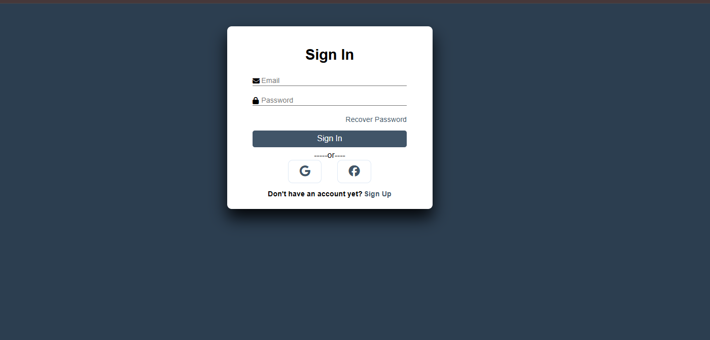
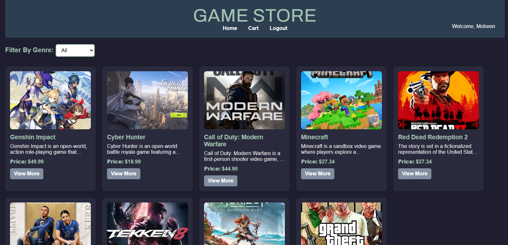
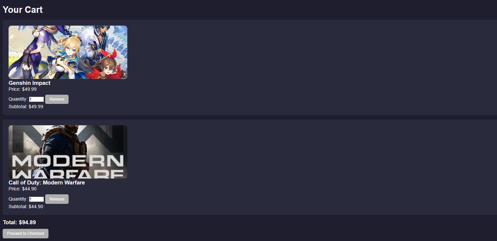
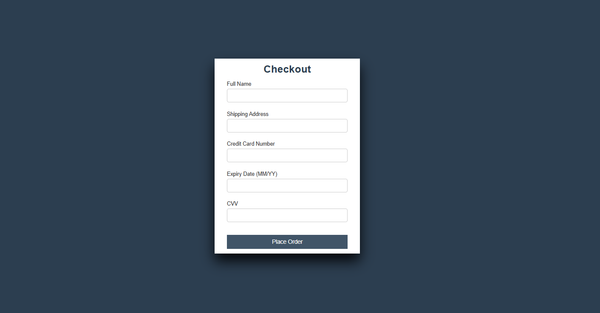

# 🎮 GameStore — Database Lab Project

A web-based game store application built with **PHP** and **Microsoft SQL Server**, developed as a university database lab project. Users can browse games, register/login, and manage a shopping cart — all backed by a relational database.

---

## ✨ Features

- 🔍 **Browse Games** — View a catalog of games with details (title, price, description)
- 🔐 **User Authentication** — Register and log in securely with session management
- 🛒 **Shopping Cart** — Add, update, and remove games from your cart
- 🗄️ **MySQL Database** — Structured relational database with game and user data

---

## 🛠️ Tech Stack

| Layer      | Technology     |
|------------|----------------|
| Backend    | PHP            |
| Frontend   | HTML, CSS      |
| Database   | Microsoft SQL Server   |
| DB Tool    | SSMS (SQL Server Management Studio) |
| Server     | Apache (XAMPP) |

---

## 📁 Project Structure

```
GAME_STORE/
├── cart/
│   ├── add_to_cart.php       # Add a game to the cart
│   ├── cart.php              # View cart contents
│   ├── db_connection.php     # SQL Server database connection
│   ├── php_info.php          # PHP environment info
│   ├── remove_from_cart.php  # Remove item from cart
│   └── update_cart.php       # Update cart quantities
├── HTML/
│   ├── images/               # Game images and assets
│   ├── index.html            # Home / game catalog
│   ├── login.html            # Login page
│   ├── product.html          # Game details page
│   ├── register.html         # Registration page
│   ├── summary.html          # Order summary page
│   └── style.css             # Global stylesheet
└── session_start.php         # Session initialization
```

---

## ⚙️ Setup & Installation

### Prerequisites

- [XAMPP](https://www.apachefriends.org/) (Apache + PHP)
- [Microsoft SQL Server](https://www.microsoft.com/en-us/sql-server) + [SSMS](https://learn.microsoft.com/en-us/sql/ssms/download-sql-server-management-studio-ssms)
- A web browser

### 1. Clone the repository

```bash
git clone https://github.com/your-username/game-store.git
```

### 2. Move to your server's web root

Copy the `GAME_STORE/` folder into your XAMPP `htdocs` directory:

```
C:/xampp/htdocs/GAME_STORE/
```

### 3. Set up the database

1. Open **SSMS** and connect to your SQL Server instance
2. Click **New Query**
3. Create a new database:
   ```sql
   CREATE DATABASE game_store;
   ```
4. Select the database and run the contents of `game.sql` to create tables and insert data

> ⚠️ Games are added directly via SSMS — there is no admin dashboard. Insert game records manually into the `games` table.

### 4. Configure the database connection

Open `cart/db_connection.php` and update your credentials:

```php
$serverName = "localhost";
$connectionInfo = array(
    "Database" => "game_store",
    "UID"      => "your_username",
    "PWD"      => "your_password"
);
$conn = sqlsrv_connect($serverName, $connectionInfo);
```

### 5. Run the application

Open your browser and go to:

```
http://localhost/GAME_STORE/HTML/index.html
```

---

## 📸 Screenshots

> _Add screenshots of your app here. Example:_

| Login | Home | Cart | Checkout |
|------|------|-------|---------|
|  |  |  |  |

---

## 🗄️ Database

Key tables in the database:

- **users** — Stores registered user accounts
- **games** — Stores the game catalog (inserted manually via SSMS)
- **cart** — Links users to their selected games

To add a game manually via SSMS:

```sql
INSERT INTO games (title, genre, price, description)
VALUES ('Game Title', 'Action', 29.99, 'A short description.');
```

---

## 👥 Authors

Made collectively for a university Database Lab course.

| Name | GitHub |
|------|--------|
| Mobeen | [@mobeenrukhsar269-crypto](https://github.com/mobeenrukhsar269-crypto) |
| Musfira Umer | [@musfiraumar](https://github.com/musfiraumar) |
| Aliza Zia | [@moonlightaliza](https://github.com/moonlightaliza) |

